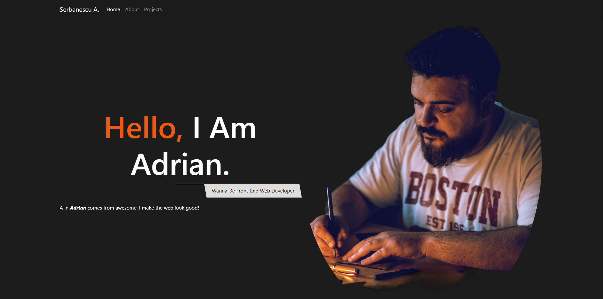

# Description
 
 This is a website i redesigned with boostrap to showcase the work I've done and to make it easier for people to contact me.

## Acceptance Criteria

* Website should have a  navigation bar made with bootstrap
* A navigation menu at the top. 
* Website should include links that are applicable to your portfolio.
* Links should navigate to the appropriate sections
* A jumbotron featuring your picture, your name, and any other information .
* A section displaying projects work in grid.
* A skills section made with bootstrap.
* An about/contact section.
* A footer section made with bootstrap.

## Work Completed

* Website shows name, profile picture, and a header with links to some page sections 
* Links work to coresponding sections
* Project section contains project cards with coresponding names
* There is a skills section made with bootstrap
* There is a navbar made with bootstrap
* there is a header made with boostrap
* Links navigate to proper section and urls

### Website Link
[Portofolio-Bootstrap](https://fishmon.github.io/Bootstrap-Portfolio/)

### Screenshot

## Contact
[Serbanescu-Claudiu Adrian](https://github.com/fishmon)
